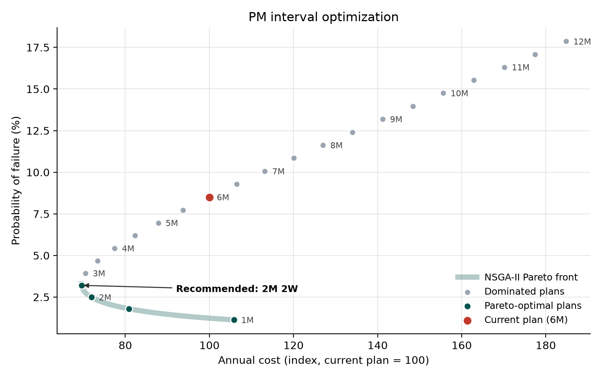
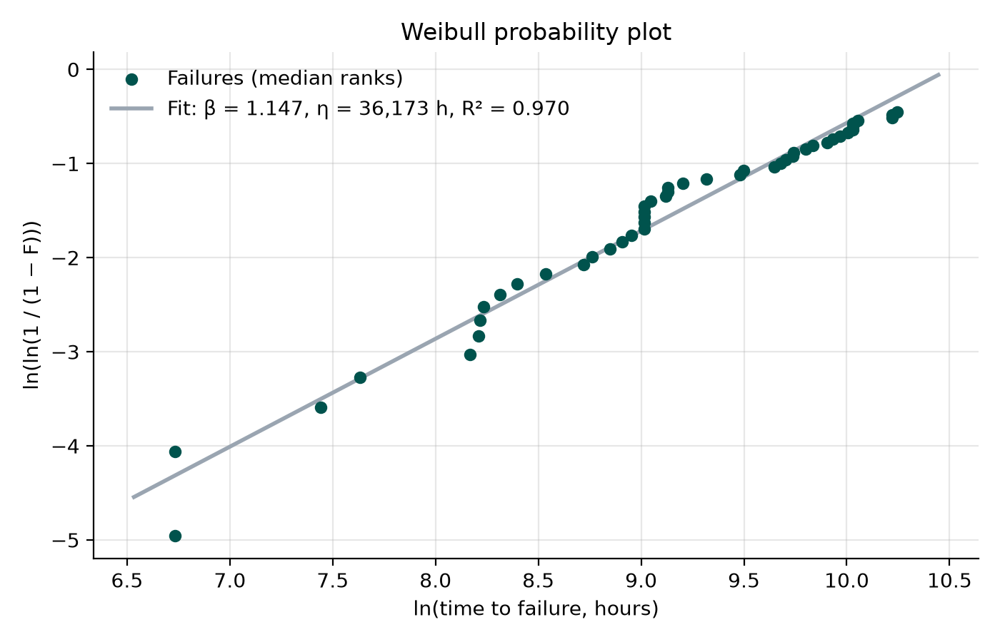
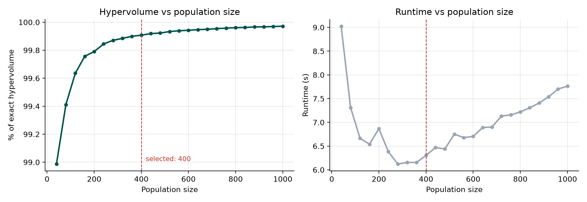

# Preventive Maintenance Optimization for Industrial Pumps

Optimizing the preventive maintenance (PM) interval for the pump systems of a urea production plant, using Weibull reliability analysis and multi-objective optimization with NSGA-II.



## Overview

The pump systems in a urea production plant are serviced on a fixed 6-month preventive maintenance plan, yet they still experience unexpected failures. This project aims to maximize the reliability of the pump systems while minimizing the total maintenance cost, by finding the PM interval that best balances the two.

The pipeline:
1. Turns four years of maintenance work orders into a time-to-failure record for each pump.
2. Fits a Weibull distribution to estimate each pump's probability of failure over time.
3. Builds a two-objective model (annual maintenance cost vs probability of failure) and optimizes the PM interval with NSGA-II.

## Key findings

- **The current 6-month plan is dominated:** shorter intervals are both cheaper and more reliable.
- **Recommended plan: every 2 months 2 weeks.** Annual cost falls by **30%** (index 100 → 69.6) and reliability over the interval rises from 91.5% to **96.8%**.
- **Failures are close to random** (β = 1.15), with only mild wear-out.
- **NSGA-II recovers the exact Pareto front** (1.00 to 2.57 months), reaching 99.91% of the exact front's hypervolume.

| Plan | Annual cost (index, current plan = 100) | Reliability over interval |
|---|---|---|
| Current: 6 months | 100.0 | 91.50% |
| **Recommended: 2 months 2 weeks** | **69.6** | **96.80%** |

Costs are shown in relative units to protect confidential data.

All Pareto-optimal plans (half-month steps):

| Plan | Annual cost (index) | Reliability |
|---|---|---|
| 1 month | 105.8 | 98.87% |
| 1 month 2 weeks | 80.9 | 98.20% |
| 2 months | 72.0 | 97.51% |
| 2 months 2 weeks | 69.6 | 96.80% |

## Method

### 1. Data preparation
711 work orders (April 2018 to February 2022) were reduced to one record per pump:
- **Failure:** the pump's first corrective work order (CMRT, CMTA), in hours from the start of the observation window.
- **Suspension:** pumps with preventive work orders (PMRT, PMTA) but no failure were still running at the end of the window, so they are right-censored at 34,080 hours.

Result: **99 pumps, 47 failures and 52 suspensions.**

### 2. Weibull analysis
The Weibull parameters were estimated by median-rank regression (Johnson's adjusted ranks for suspensions, Bernard's approximation for median ranks):

| β (shape) | η (scale) | R² |
|---|---|---|
| 1.147 | 36,173 hours (49.5 months) | 0.970 |

Including the suspensions matters: fitting the 47 failures alone would give η ≈ 13,700 hours, badly underestimating pump life.

<p align="center"></p>

### 3. Optimization model
The decision variable is the PM interval $x$ (1 to 12 months). Both objectives are minimized:

$$C(x) = \frac{12}{x}\, C_{PM}\, n + F(x)\, C_{CM}\, n \qquad\qquad F(x) = 1 - e^{-(x/\eta)^{\beta}}$$

where $n$ = 99 pumps, $C_{PM}$ = 1 (one PM job) and $C_{CM}$ ≈ 125.66 (average corrective job, relative to a PM job). Annual cost is reported as an index, with the current 6-month plan = 100.

Because the problem has a single decision variable, its exact Pareto front was also computed by grid search and used to validate NSGA-II.

### 4. NSGA-II and parameter tuning
NSGA-II ([pymoo](https://pymoo.org)) was run with SBX crossover and polynomial mutation under a fixed budget of 50,000 evaluations. Settings were compared by **hypervolume**, measured from a reference point 10% beyond the exact front's worst corner:

- **Significance tests** (5 runs per level, two-sample t-test): only **population size** has a practically meaningful effect (about 1 percentage point of hypervolume). Mutation and crossover settings change it by less than 0.01 points.
- **Population sweep** (40 to 1,000): hypervolume levels off after about 250, and runtime is lowest around 300 to 400, so a **population of 400** was used.

<p align="center"></p>

## Limitations

- Every corrective work order is treated as a pump failure, including some jobs that are not pump failures (e.g. an oil-change campaign recorded as corrective work, visible as a vertical stack of points in the probability plot).
- Time is measured from the start of the data (April 2018), not from pump installation, since installation dates are not available.
- A single Weibull distribution is fitted to all pumps, although different pumps and failure modes (e.g. mechanical seals, bearings) may behave differently.

## Project structure

```
pump-pm-optimization/
├── 01_data_preparation.ipynb     work orders → failure times per pump
├── 02_weibull_analysis.ipynb     Weibull fit and reliability curves
├── 03_nsga2_optimization.ipynb   cost model, exact front, NSGA-II, tuning, results
├── pm_optimization.py            shared functions used by all notebooks
├── tests/                        unit tests (pytest)
├── data/
│   ├── raw/                      confidential work orders (not included)
│   ├── failure_times.csv         one record per pump (output of notebook 01)
│   ├── weibull_params.json       fitted parameters (output of notebook 02)
│   └── tuning_*.csv              saved NSGA-II tuning results
├── figures/                      charts used in this README
└── requirements.txt
```

## Run locally

```
git clone https://github.com/IsaN2003/pump-pm-optimization.git
cd pump-pm-optimization

python -m venv .venv
.venv\Scripts\activate          # Windows  (use: source .venv/bin/activate on macOS/Linux)

pip install -r requirements.txt
python -m pytest                # run the unit tests
```

Then open the notebooks and run them in order.

The raw work orders are confidential and not included, so notebook 01 only runs where the raw export is available. Its output, `data/failure_times.csv`, ships with the repo, so notebooks 02 and 03 run as-is. Notebook 03 loads the saved tuning results; set `RUN_TUNING = True` to re-run the experiments (about 10 minutes).

## Tech stack

Python · pandas · NumPy · SciPy · Matplotlib · pymoo · pytest

Built as a data-science portfolio project.